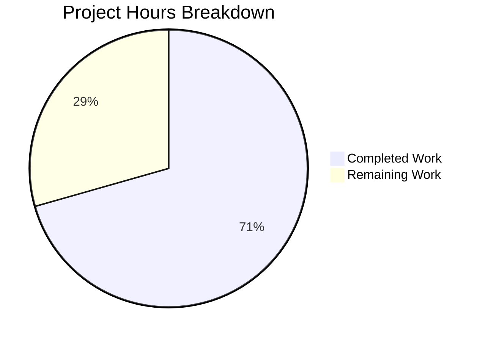

# Project Guide — Programmatic Dark Mode Theme Configuration for Swagger UI v5.31.0

## 1. Executive Summary

This project adds a programmatic dark mode theme configuration system to Swagger UI v5.31.0, introducing a `theme` configuration parameter (`'light'`, `'dark'`, `'auto'`) to `SwaggerUIBundle` initialization options. The feature enables programmatic control over UI appearance with localStorage persistence and OS-level `prefers-color-scheme` synchronization.

**Completion: 48 hours completed out of 68 total hours = 70.6% complete.**

All code implementation, unit testing, build compilation, linting, and documentation have been completed. The remaining 20 hours consist of human verification tasks including code review, cross-browser testing, accessibility verification, and deployment validation.

### Key Achievements
- **5 new source files** created for the core theme plugin (`src/core/plugins/theme/`)
- **9 existing files** modified across config pipeline, plugin registration, standalone integration, styling, distribution channels, and documentation
- **2 test files** created/updated with 43 new unit tests (38 plugin + 5 DarkModeToggle)
- **All 6 webpack builds** compile successfully (stylesheets, core, bundle, standalone, ES bundle, ES bundle core)
- **68/68 active test suites pass** with 845/845 active tests passing
- **ESLint**: 0 errors, 0 warnings across all source, test, dev-helpers, and flavors
- **Zero in-scope issues remaining**

### Validation Fixes Applied
- Resolved 19 Prettier formatting errors in `test/unit/core/plugins/theme/index.js` (indentation of `classList.contains` assertions)
- 1 commit applied: `fix: resolve Prettier formatting issues in theme plugin unit tests`

---

## 2. Validation Results Summary

### 2.1 Build Compilation Results

| Build Target | Status | Notes |
|---|---|---|
| `build-stylesheets` | ✅ PASS | CSS custom properties compiled successfully |
| `build:core` | ✅ PASS | Core plugin with ThemePlugin included |
| `build:bundle` | ✅ PASS | Bundle distribution with theme support |
| `build:standalone` | ✅ PASS | Standalone with DarkModeToggle integration |
| `build:es:bundle` | ✅ PASS | ES module bundle |
| `build:es:bundle:core` | ✅ PASS | ES module core bundle |

### 2.2 Test Execution Results

| Metric | Value |
|---|---|
| Test Suites (active) | 68/68 passed |
| Test Suites (skipped) | 3 (pre-existing `describe.skip` in out-of-scope files) |
| Tests (active) | 845/845 passed |
| Tests (skipped) | 12 (pre-existing `it.skip` in out-of-scope files) |
| Theme Plugin Tests | 38/38 passed |
| DarkModeToggle Tests | 5/5 passed |
| Execution Time | ~11 seconds |

### 2.3 Linting Results

| Tool | Errors | Warnings |
|---|---|---|
| ESLint | 0 | 0 |

### 2.4 Git Repository Analysis

| Metric | Value |
|---|---|
| Total commits on branch | 20 |
| Files changed | 18 |
| Lines added | 1,224 |
| Lines removed | 23 |
| Net change | +1,201 lines |
| New source files | 5 |
| Modified source files | 9 |
| New/modified test files | 2 |
| Modified documentation | 1 |
| Build artifacts modified | 1 (dist/swagger-ui-bundle.js) |

---

## 3. Project Hours Breakdown

### 3.1 Completed Hours Calculation (48h)

| Component | Hours | Details |
|---|---|---|
| Core Plugin Development | 15h | actions.js (4h), reducers.js (1h), selectors.js (2h), after-load.js (5h), index.js (1h), pattern research (2h) |
| DarkModeToggle Refactoring | 4h | Analysis (1h) + refactoring to plugin integration (3h) |
| CSS Custom Properties | 3h | Design token research (1h) + _dark-mode.scss additions (2h) |
| Configuration Pipeline | 1h | defaults.js (0.5h) + mappings.js (0.5h) |
| Plugin Registration | 1h | base/index.js (0.5h) + core/index.js (0.5h) |
| Distribution Channels | 2h | Docker variables.js (0.5h) + React wrapper (1.5h) |
| Unit Testing | 15h | Theme plugin tests (12h) + DarkModeToggle test updates (3h) |
| Documentation | 1.5h | configuration.md updates |
| Debugging & Validation | 5.5h | Prettier fixes (1h), lint (0.5h), builds (1.5h), test debugging (2.5h) |
| **Total Completed** | **48h** | |

### 3.2 Remaining Hours Calculation (20h)

Base remaining estimate: 14h × enterprise multipliers (1.15 compliance × 1.25 uncertainty) ≈ 20h

| Task | Base Hours | After Multipliers | Priority |
|---|---|---|---|
| Code review of all 16 changed files | 3h | 4h | High |
| Cross-browser testing (Chrome, Firefox, Safari, Edge) | 3h | 4h | High |
| WCAG 2.1 AA contrast ratio verification | 1.5h | 2h | High |
| Docker THEME environment variable deployment testing | 1.5h | 2h | Medium |
| Flash-free loading and performance verification | 1h | 2h | Medium |
| React wrapper (`swagger-ui-react`) integration testing | 1h | 2h | Medium |
| E2E/integration testing with real API specifications | 2h | 3h | Medium |
| Documentation review and copyediting | 1h | 1h | Low |
| **Total Remaining** | **14h** | **20h** | |

### 3.3 Completion Calculation

```
Completed Hours: 48h
Remaining Hours: 20h
Total Project Hours: 48h + 20h = 68h
Completion: 48 / 68 = 70.6%
```

### 3.4 Hours Visualization



---

## 4. Implementation Inventory

### 4.1 New Files Created (5)

| File | Lines | Purpose |
|---|---|---|
| `src/core/plugins/theme/index.js` | 38 | Plugin entry point — factory function with `statePlugins.theme` namespace |
| `src/core/plugins/theme/actions.js` | 98 | `SET_THEME` constant + `setTheme` thunk (localStorage, matchMedia, DOM class) |
| `src/core/plugins/theme/reducers.js` | 31 | Immutable reducer storing `currentTheme` in state |
| `src/core/plugins/theme/selectors.js` | 58 | `currentTheme` and `isDarkMode` selectors with SSR safety |
| `src/core/plugins/theme/after-load.js` | 108 | Lifecycle hook for config read, localStorage check, auto-resolution, media query listener |

### 4.2 Modified Files (9)

| File | Change | Lines Changed |
|---|---|---|
| `src/core/config/defaults.js` | Added `theme: "light"` to frozen defaults | +1 |
| `src/core/config/type-cast/mappings.js` | Added `theme: { typeCaster: stringTypeCaster }` | +1 |
| `src/core/presets/base/index.js` | Imported and registered ThemePlugin | +2 |
| `src/core/index.js` | Imported ThemePlugin, added to `SwaggerUI.plugins` | +2 |
| `src/standalone/plugins/top-bar/components/DarkModeToggle.jsx` | Refactored from internal state to theme plugin integration | +33/-22 |
| `src/style/_dark-mode.scss` | Added CSS custom properties at `:root` and `html.dark-mode` | +44 |
| `docker/configurator/variables.js` | Added `THEME: { type: "string", name: "theme" }` | +4 |
| `flavors/swagger-ui-react/index.jsx` | Added `theme` prop with default and PropTypes | +3 |
| `docs/usage/configuration.md` | Added `theme` parameter documentation | +25 |

### 4.3 Test Files (2)

| File | Lines | Tests | Status |
|---|---|---|---|
| `test/unit/core/plugins/theme/index.js` | 619 | 38 | All passing |
| `test/unit/standalone/plugins/top-bar/DarkModeToggle.jsx` | 104 | 5 | All passing |

---

## 5. Detailed Human Task Table

All remaining tasks require human developer involvement for verification and validation.

| # | Task | Description | Action Steps | Hours | Priority | Severity |
|---|---|---|---|---|---|---|
| 1 | Code Review | Review all 16 changed files for correctness, patterns, and edge cases | 1. Review 5 new theme plugin files for plugin pattern compliance 2. Review 9 modified files for minimal change principle 3. Verify backward compatibility of DarkModeToggle refactoring 4. Review test coverage adequacy | 4h | High | High |
| 2 | Cross-Browser Testing | Manually test dark mode in all target browsers | 1. Test theme='dark' in Chrome, Firefox, Safari, Edge 2. Test theme='auto' with OS dark/light preference 3. Test DarkModeToggle button in standalone layout 4. Verify localStorage persistence across sessions 5. Test theme switching doesn't cause flash | 4h | High | High |
| 3 | WCAG Contrast Verification | Verify all dark mode elements meet accessibility standards | 1. Use browser DevTools or axe to audit contrast ratios 2. Verify 4.5:1 minimum for normal text 3. Verify 3:1 minimum for large text and interactive elements 4. Check method badges maintain semantic color meaning 5. Verify focus indicators visible in dark mode | 2h | High | High |
| 4 | Docker Deployment Testing | Test THEME environment variable in containerized deployment | 1. Build Docker image with current codebase 2. Run container with `-e THEME=dark` and verify dark mode 3. Run container with `-e THEME=auto` and verify 4. Run container without THEME variable and verify light default 5. Verify nginx configurator processes THEME correctly | 2h | Medium | Medium |
| 5 | Performance Verification | Verify theme switching meets performance constraints | 1. Measure theme switch time (must be <50ms) 2. Test flash-free loading with theme='dark' 3. Test flash-free loading with theme='auto' resolving to dark 4. Verify localStorage operations don't cause jank 5. Profile afterLoad hook execution time | 2h | Medium | Medium |
| 6 | React Wrapper Testing | Verify swagger-ui-react theme prop works correctly | 1. Create test React application importing swagger-ui-react 2. Pass `theme="dark"` prop and verify dark mode renders 3. Pass `theme="auto"` prop and verify system detection 4. Verify prop changes trigger theme updates 5. Verify PropTypes validation catches invalid values | 2h | Medium | Medium |
| 7 | E2E Integration Testing | Test with real OpenAPI specifications end-to-end | 1. Load Swagger UI with Petstore spec in dark mode 2. Verify all endpoint sections render correctly 3. Test Try It Out forms in dark mode 4. Test authorization dialogs in dark mode 5. Test model/schema display in dark mode 6. Verify response rendering with syntax highlighting | 3h | Medium | Medium |
| 8 | Documentation Review | Review and polish configuration documentation | 1. Verify configuration.md theme entry is accurate 2. Check for typos and formatting consistency 3. Ensure Docker variable reference is correct 4. Review against existing documentation style | 1h | Low | Low |
| | **Total Remaining Hours** | | | **20h** | | |

---

## 6. Development Guide

### 6.1 System Prerequisites

| Requirement | Version | Notes |
|---|---|---|
| Node.js | 22.11.0 | Specified in `.nvmrc`; Node 20.x also works for builds |
| npm | 10.9.0+ | Comes with Node.js 22.11.0 |
| Git | 2.x+ | For repository operations |
| nvm (recommended) | Latest | For Node.js version management |

### 6.2 Environment Setup

```bash
# 1. Clone and checkout the feature branch
git clone <repository-url>
cd swagger-ui
git checkout blitzy-cb43b964-0d37-48f4-bf2b-73f3bd4c7c16

# 2. Set up Node.js version (recommended via nvm)
export NVM_DIR="$HOME/.nvm"
[ -s "$NVM_DIR/nvm.sh" ] && . "$NVM_DIR/nvm.sh"
nvm install 22.11.0
nvm use 22.11.0

# 3. Verify Node.js version
node --version
# Expected output: v22.11.0

# 4. Install dependencies (deterministic install from lockfile)
npm ci
```

### 6.3 Build the Project

```bash
# Build all distribution targets (stylesheets, core, bundle, standalone, ES modules)
CI=true npm run build

# Expected: 6 webpack compilations, all reporting "compiled successfully"
# Build targets:
#   - build-stylesheets (CSS output)
#   - build:core (swagger-ui.js)
#   - build:bundle (swagger-ui-bundle.js)
#   - build:standalone (swagger-ui-standalone-preset.js)
#   - build:es:bundle (swagger-ui-es-bundle.js)
#   - build:es:bundle:core (swagger-ui-es-bundle-core.js)
```

### 6.4 Run Tests

```bash
# Run the complete unit test suite
NODE_ENV=test BABEL_ENV=commonjs BROWSERSLIST_ENV=node-development \
  CI=true npx jest --config ./config/jest/jest.unit.config.js \
  --watchAll=false --ci --maxWorkers=2

# Expected output:
#   Test Suites: 3 skipped, 68 passed, 68 of 71 total
#   Tests:       12 skipped, 845 passed, 857 total

# Run only theme-related tests
NODE_ENV=test BABEL_ENV=commonjs BROWSERSLIST_ENV=node-development \
  CI=true npx jest --config ./config/jest/jest.unit.config.js \
  --watchAll=false --ci --maxWorkers=2 \
  test/unit/core/plugins/theme test/unit/standalone/plugins/top-bar/DarkModeToggle.jsx

# Expected output:
#   Test Suites: 2 passed, 2 total
#   Tests:       43 passed, 43 total
```

### 6.5 Run Linting

```bash
# Run ESLint (errors only, quiet mode)
CI=true npm run lint-errors

# Expected: Exit code 0, no output (clean)
```

### 6.6 Development Server

```bash
# Start the development server (for manual testing)
npm run dev

# Opens browser at http://localhost:3200
# The dev server uses dev-helpers/index.html and dev-helpers/dev-helper-initializer.js
```

### 6.7 Testing the Theme Feature

#### JavaScript Configuration
```javascript
// Dark mode
SwaggerUIBundle({
  url: "https://petstore3.swagger.io/api/v3/openapi.json",
  dom_id: '#swagger-ui',
  theme: 'dark'
})

// Auto mode (follows OS preference)
SwaggerUIBundle({
  url: "https://petstore3.swagger.io/api/v3/openapi.json",
  dom_id: '#swagger-ui',
  theme: 'auto'
})

// Light mode (default — identical to current behavior)
SwaggerUIBundle({
  url: "https://petstore3.swagger.io/api/v3/openapi.json",
  dom_id: '#swagger-ui',
  theme: 'light'
})
```

#### React Wrapper
```jsx
import SwaggerUI from "swagger-ui-react"

function App() {
  return <SwaggerUI url="https://petstore3.swagger.io/api/v3/openapi.json" theme="dark" />
}
```

#### Docker
```bash
docker run -p 8080:8080 -e SWAGGER_JSON_URL=https://petstore3.swagger.io/api/v3/openapi.json -e THEME=dark swagger-ui
```

### 6.8 Verification Checklist

- [ ] `npm run build` completes with 6 successful webpack compilations
- [ ] `npm run lint-errors` exits cleanly with no output
- [ ] Jest test suite passes with 68/68 active suites and 845/845 active tests
- [ ] Theme plugin test file passes 38/38 tests
- [ ] DarkModeToggle test file passes 5/5 tests
- [ ] Development server loads in dark mode when `theme: 'dark'` is configured
- [ ] Theme preference persists in localStorage under `swagger-ui-theme` key
- [ ] Auto mode responds to OS `prefers-color-scheme` changes

---

## 7. Risk Assessment

### 7.1 Technical Risks

| Risk | Severity | Likelihood | Mitigation |
|---|---|---|---|
| Flash of light content before dark mode applies in slow environments | Low | Low | `afterLoad` hook applies CSS class synchronously before React render; DOM manipulation is sub-millisecond |
| localStorage quota exceeded in edge cases | Low | Very Low | `try/catch` wrapping on all localStorage operations with graceful fallback to session-only theming |
| matchMedia unavailable in SSR environments | Low | Low | All matchMedia calls wrapped in `try/catch` with fallback to light mode; selectors are SSR-safe |
| DarkModeToggle backward compatibility if themeSelectors/themeActions not injected | Low | Low | Component uses optional chaining (`themeSelectors?.isDarkMode?.()`) and falls back to direct DOM toggle |

### 7.2 Security Risks

| Risk | Severity | Likelihood | Mitigation |
|---|---|---|---|
| localStorage key collision with other applications on same origin | Low | Very Low | Key is prefixed with `swagger-ui-` namespace; value is validated against allowlist before use |
| XSS via theme value injection | Very Low | Very Low | Theme value is validated against strict allowlist (`['light', 'dark', 'auto']`); only CSS class names are applied, no dynamic HTML |

### 7.3 Operational Risks

| Risk | Severity | Likelihood | Mitigation |
|---|---|---|---|
| CSS custom properties not supported in older browsers | Low | Low | Target browsers (latest 2 versions of Chrome/Firefox/Safari/Edge) all support CSS custom properties; falls back to Sass-compiled values |
| Docker THEME variable misconfiguration | Low | Low | String type-caster normalizes value; invalid values result in default light mode |

### 7.4 Integration Risks

| Risk | Severity | Likelihood | Mitigation |
|---|---|---|---|
| Third-party Swagger UI plugins may not support dark mode styling | Medium | Medium | CSS custom properties provide override surface; existing `_dark-mode.scss` covers all core components; third-party plugins may need their own dark mode CSS |
| React wrapper prop changes not triggering theme update mid-session | Low | Medium | Theme is read at initialization; runtime prop changes require SwaggerUI re-initialization (consistent with other config props) |

---

## 8. Architecture Overview

### 8.1 Theme Data Flow

```
User Config (theme: 'dark')
    ↓
Config Pipeline (defaults.js → type-cast → merge)
    ↓
ThemePlugin afterLoad (reads config, checks localStorage, resolves 'auto')
    ↓
DOM: document.documentElement.classList.add('dark-mode')
    ↓
Redux: dispatch SET_THEME → reducer → state.set('currentTheme', 'dark')
    ↓
Components: themeSelectors.isDarkMode() → true
    ↓
DarkModeToggle: renders LightBulb (ON) icon
```

### 8.2 File Dependency Map

```
src/core/plugins/theme/
├── index.js          ← imports actions, reducers, selectors, afterLoad
├── actions.js        ← standalone (uses Web APIs: localStorage, matchMedia, classList)
├── reducers.js       ← imports SET_THEME from actions.js
├── selectors.js      ← standalone (uses Web API: matchMedia)
└── after-load.js     ← standalone (uses system.themeActions, system.getConfigs)

Registration:
├── src/core/presets/base/index.js  ← imports ThemePlugin from theme/index.js
└── src/core/index.js               ← imports ThemePlugin from theme/index.js

Consumers:
├── src/standalone/plugins/top-bar/components/DarkModeToggle.jsx  ← uses themeActions, themeSelectors
├── flavors/swagger-ui-react/index.jsx                            ← forwards theme prop
└── docker/configurator/variables.js                              ← maps THEME env var
```

---

## 9. Files Changed Summary

### 9.1 Complete File Manifest

| # | File Path | Action | Lines | Status |
|---|---|---|---|---|
| 1 | `src/core/plugins/theme/index.js` | Created | 38 | ✅ Complete |
| 2 | `src/core/plugins/theme/actions.js` | Created | 98 | ✅ Complete |
| 3 | `src/core/plugins/theme/reducers.js` | Created | 31 | ✅ Complete |
| 4 | `src/core/plugins/theme/selectors.js` | Created | 58 | ✅ Complete |
| 5 | `src/core/plugins/theme/after-load.js` | Created | 108 | ✅ Complete |
| 6 | `src/core/config/defaults.js` | Modified | +1 | ✅ Complete |
| 7 | `src/core/config/type-cast/mappings.js` | Modified | +1 | ✅ Complete |
| 8 | `src/core/presets/base/index.js` | Modified | +2 | ✅ Complete |
| 9 | `src/core/index.js` | Modified | +2 | ✅ Complete |
| 10 | `src/standalone/plugins/top-bar/components/DarkModeToggle.jsx` | Modified | +33/-22 | ✅ Complete |
| 11 | `src/style/_dark-mode.scss` | Modified | +44 | ✅ Complete |
| 12 | `docker/configurator/variables.js` | Modified | +4 | ✅ Complete |
| 13 | `flavors/swagger-ui-react/index.jsx` | Modified | +3 | ✅ Complete |
| 14 | `docs/usage/configuration.md` | Modified | +25 | ✅ Complete |
| 15 | `test/unit/core/plugins/theme/index.js` | Created | 619 | ✅ 38/38 tests pass |
| 16 | `test/unit/standalone/plugins/top-bar/DarkModeToggle.jsx` | Modified | 104 | ✅ 5/5 tests pass |
