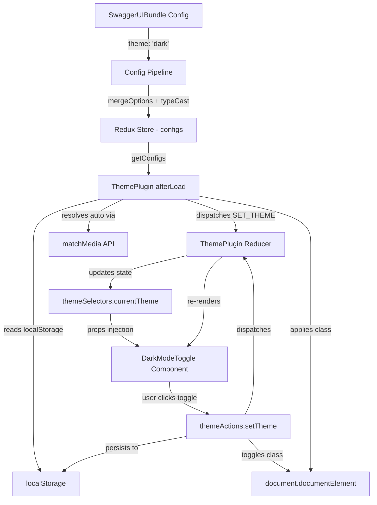

# Technical Specification

# 0. Agent Action Plan

## 0.1 Intent Clarification

### 0.1.1 Core Feature Objective

Based on the prompt, the Blitzy platform understands that the new feature requirement is to **add a programmatic dark mode theme configuration system to Swagger UI v5.31.0** that extends the existing partial dark mode implementation into a fully configurable, persistent, and standards-compliant theming capability. Specifically:

- **Introduce a `theme` configuration parameter** to the `SwaggerUIBundle` initialization options, accepting three enumerated values: `'light'` (default), `'dark'`, and `'auto'`, enabling programmatic control over UI appearance without requiring the standalone layout or manual user interaction.
- **Persist theme preference across browser sessions** using `localStorage`, so a developer's chosen theme survives page reloads and browser restarts without requiring re-configuration.
- **Implement system preference detection** when `theme` is set to `'auto'`, synchronizing the UI appearance with the operating system's `prefers-color-scheme` media query and responding to runtime changes.
- **Ensure all UI components render correctly in dark mode**, including navigation elements, API endpoint listings, method badges, request/response code blocks, syntax highlighting, form inputs, modal dialogs, error messages, table components, and schema documentation panels.
- **Maintain WCAG 2.1 AA contrast ratios** (minimum 4.5:1 for normal text, 3:1 for large text) across all text and interactive elements in dark mode.
- **Expose CSS custom properties (CSS variables)** for dark mode color palette tokens, enabling downstream customization without Sass compilation.
- **Ensure backward compatibility** with all existing Swagger UI configurations, plugins, extensions, and the three distribution channels (core, standalone, React wrapper), so that deployments without the `theme` parameter continue to behave identically to current behavior.

**Implicit requirements detected:**
- The existing `DarkModeToggle` component in the standalone TopBar must be upgraded to synchronize with the new config-driven theme state rather than maintaining its own isolated state.
- The Docker container deployment must support a `THEME` environment variable so that containerized instances can configure theme at runtime.
- The `swagger-ui-react` wrapper must forward the `theme` prop so React-based embeddings have parity with the bundle configuration.
- The syntax highlighting theme should automatically adapt when dark mode is active, selecting a dark-background-optimized highlight style (the existing default `"agate"` is already dark-friendly, but `"idea"` should be used for light mode if syntax highlight theme is not explicitly overridden).
- Theme switching must be flash-free — the CSS class must be applied before the first paint, preventing a flash of unstyled (light) content when `theme` is `'dark'` or resolved as dark via `'auto'`.

### 0.1.2 Special Instructions and Constraints

- **Minimal change directive**: The user explicitly requires that only changes absolutely necessary for the feature are made. Existing code must not be refactored, optimized, or modified unless directly required for dark mode theme configuration to function. New code should be isolated in dedicated files/components when possible.
- **Backward compatibility mandate**: Current implementations that do not specify a `theme` parameter must continue to render in light mode with identical behavior — there must be zero visual regressions in light mode.
- **Plugin architecture adherence**: The feature must follow Swagger UI's established plugin pattern (`statePlugins` with actions, reducers, selectors, and lifecycle hooks) as documented in `docs/customization/plugin-api.md` and implemented across all 26 existing core plugins.
- **Existing conventions**: Follow the repository's linting rules (ESLint with Prettier integration, `.eslintrc.js`), Sass architecture (partials with shared tokens from `_variables.scss` and mixins from `_mixins.scss`), and test patterns (Jest + Enzyme for unit tests, Cypress for e2e).
- **No custom theme builder**: The user explicitly excludes a custom theme builder, advanced theming engine, multiple dark theme variants, per-component theme overrides, and animation/transition effects for theme switching.

User Example — Configuration:
```javascript
SwaggerUIBundle({
  url: "https://api.example.com/openapi.json",
  dom_id: '#swagger-ui',
  theme: 'dark', // Options: 'light', 'dark', 'auto'
  deepLinking: true
});
```

### 0.1.3 Technical Interpretation

These feature requirements translate to the following technical implementation strategy:

- To **add the `theme` configuration parameter**, we will add a `theme: "light"` entry to `src/core/config/defaults.js` and register a string type-caster in `src/core/config/type-cast/mappings.js`.
- To **manage theme state at the core level**, we will create a new `src/core/plugins/theme/` plugin following the established plugin pattern (actions, reducers, selectors, `afterLoad` hook) and register it in the base preset at `src/core/presets/base.js`.
- To **persist theme preference**, we will implement `localStorage` read/write within the theme plugin's action creators, storing the resolved theme value under a well-known key.
- To **support system preference detection**, we will implement a `matchMedia('(prefers-color-scheme: dark)')` listener within the theme plugin's `afterLoad` hook that activates only when theme is set to `'auto'`.
- To **synchronize the standalone DarkModeToggle**, we will modify `src/standalone/plugins/top-bar/components/DarkModeToggle.jsx` to read from the theme plugin's selectors and dispatch the theme plugin's actions, replacing its internal state management.
- To **expose CSS custom properties**, we will add `:root` and `html.dark-mode` CSS variable declarations in `src/style/_dark-mode.scss` that downstream consumers can override.
- To **support Docker deployments**, we will add a `THEME` entry to `docker/configurator/variables.js`.
- To **support the React wrapper**, we will add a `theme` prop to `flavors/swagger-ui-react/index.jsx`.
- To **ensure quality**, we will create unit tests in `test/unit/core/plugins/theme/` and update the existing `DarkModeToggle` test at `test/unit/standalone/plugins/top-bar/DarkModeToggle.jsx`.


## 0.2 Repository Scope Discovery

### 0.2.1 Comprehensive File Analysis

A systematic traversal of the Swagger UI v5.31.0 repository reveals the following file landscape relevant to implementing the dark mode theme configuration feature. The repository is a monolithic JavaScript/React distribution with Sass styling, a Redux/Immutable.js state layer, a 26-plugin architecture, and six distribution channels.

**Existing dark mode foundation files (already present, require modification):**

| File Path | Current Purpose | Required Modification |
|---|---|---|
| `src/style/_dark-mode.scss` | Comprehensive dark mode stylesheet scoped under `html.dark-mode` with neutral palette, HTTP method overrides, input/select/textarea theming, topbar, modal, operation, model, JSON Schema 2020-12, and section styling | Add CSS custom property declarations at `:root` and `html.dark-mode` scope for palette customization |
| `src/standalone/plugins/top-bar/components/DarkModeToggle.jsx` | Stateful React component with `isDarkMode` internal state, `prefers-color-scheme` detection on mount, `document.documentElement.classList.toggle('dark-mode')` behavior | Refactor to consume theme plugin selectors/actions via `getComponent`/props instead of managing isolated state |
| `src/standalone/plugins/top-bar/index.js` | TopBarPlugin factory exporting `{ Topbar: TopBar, Logo, DarkModeToggle }` components | No modification required — DarkModeToggle component name stays the same |

**Configuration pipeline files (require modification):**

| File Path | Current Purpose | Required Modification |
|---|---|---|
| `src/core/config/defaults.js` | Frozen `defaultOptions` object with 40+ config options, no `theme` entry | Add `theme: "light"` entry to the frozen defaults object |
| `src/core/config/type-cast/mappings.js` | Exhaustive mapping of config keys to type-casters (string, boolean, number, etc.) | Add `theme: { typeCaster: stringTypeCaster }` mapping |
| `docker/configurator/variables.js` | `standardVariables` and `legacyVariables` mapping env vars to config names | Add `THEME: { type: "string", name: "theme" }` to standardVariables |

**Plugin registration files (require modification):**

| File Path | Current Purpose | Required Modification |
|---|---|---|
| `src/core/presets/base.js` | Base preset array aggregating core plugins for all builds | Add ThemePlugin import and registration |
| `src/core/index.js` | SwaggerUI factory function exporting `SwaggerUI.plugins` registry | Add ThemePlugin to `SwaggerUI.plugins` export map |

**React wrapper (requires modification):**

| File Path | Current Purpose | Required Modification |
|---|---|---|
| `flavors/swagger-ui-react/index.jsx` | React wrapper component mapping props to SwaggerUI config | Add `theme` prop with PropTypes validation and pass-through |

**Documentation files (require modification):**

| File Path | Current Purpose | Required Modification |
|---|---|---|
| `docs/usage/configuration.md` | Canonical configuration reference with Core/Display/Network categories | Add `theme` parameter documentation in Display section |

**Test files (require modification):**

| File Path | Current Purpose | Required Modification |
|---|---|---|
| `test/unit/standalone/plugins/top-bar/DarkModeToggle.jsx` | Jest + Enzyme unit test for DarkModeToggle class toggle behavior | Update to test config-driven theme behavior and localStorage persistence |

**Integration point discovery:**

- **Config pipeline**: `src/core/config/defaults.js` → `src/core/config/type-cast/mappings.js` → `src/core/config/merge.js` → `src/core/config/index.js` — the `theme` option flows through the existing merge/type-cast pipeline without additional changes to merge or index modules.
- **Plugin system**: `src/core/system.js` — the System orchestrator registers plugins with `statePlugins` entries; no modification needed as the theme plugin follows the existing contract.
- **Standalone preset**: `src/standalone/presets/standalone/index.js` — no modification needed since the theme plugin is registered at the base preset level, making it available to all builds including standalone.
- **Webpack build pipeline**: `webpack/` configs — no modification needed; the new plugin module is resolved by existing Babel/Webpack rules.

### 0.2.2 New File Requirements

**New source files to create:**

| File Path | Purpose |
|---|---|
| `src/core/plugins/theme/index.js` | Theme plugin entry point — exports plugin descriptor with `statePlugins.theme` namespace containing actions, reducers, selectors, and `afterLoad` hook |
| `src/core/plugins/theme/actions.js` | Action constants (`SET_THEME`) and action creators (`setTheme(themeValue)`) with localStorage persistence |
| `src/core/plugins/theme/reducers.js` | Immutable reducer handling `SET_THEME` action, storing the resolved theme value |
| `src/core/plugins/theme/selectors.js` | Selectors for reading current theme value and computed dark mode boolean |
| `src/core/plugins/theme/after-load.js` | `afterLoad` lifecycle hook that reads theme from config, checks localStorage, resolves `'auto'` via `matchMedia`, applies `dark-mode` class to `document.documentElement`, and attaches media query change listener |

**New test files to create:**

| File Path | Purpose |
|---|---|
| `test/unit/core/plugins/theme/index.js` | Unit tests for theme plugin registration, actions, reducers, selectors, and afterLoad behavior |

### 0.2.3 Web Search Research Conducted

No external web searches were required for this feature implementation plan. The implementation leverages exclusively:
- Existing Swagger UI patterns for plugin development (documented in `docs/customization/plugin-api.md`)
- Standard Web APIs (`localStorage`, `matchMedia`, `document.documentElement.classList`)
- The established Sass design token architecture in `src/style/`
- WCAG 2.1 AA contrast ratio requirements (4.5:1 minimum for normal text) which the existing `_dark-mode.scss` palette already satisfies based on the neutral color scale defined (`$neutral-10: #F0F1F1` through `$neutral-100: #080A0B`)


## 0.3 Dependency Inventory

### 0.3.1 Private and Public Packages

This feature requires **no new dependencies**. All implementation relies on existing packages already present in the project's `package.json` and standard Web APIs available in all target browsers.

**Key existing packages relevant to this feature:**

| Registry | Package | Version | Purpose for Theme Feature |
|---|---|---|---|
| npm (dependency) | `react` | `>=16.8.0 <20` | Component rendering for DarkModeToggle and theme plugin components |
| npm (dependency) | `react-dom` | `>=16.8.0 <20` | DOM manipulation for `document.documentElement` class toggling |
| npm (dependency) | `redux` | `^5.0.1` | State management for theme plugin's Redux store slice |
| npm (dependency) | `immutable` | `^3.x.x` | Immutable.js data structures for theme reducer state |
| npm (dependency) | `redux-immutable` | `^4.0.0` | Immutable-compatible combineReducers used by system.js |
| npm (dependency) | `prop-types` | `^15.8.1` | PropTypes validation for DarkModeToggle and React wrapper |
| npm (dependency) | `react-syntax-highlighter` | `^16.0.0` | Existing syntax highlighting with theme-aware style selection |
| npm (dependency) | `deep-extend` | `0.6.0` | Config merge pipeline used during option processing |
| npm (devDependency) | `jest` | `=29.7.0` | Unit test runner for theme plugin tests |
| npm (devDependency) | `enzyme` | `=3.11.0` | React component test utility for DarkModeToggle tests |
| npm (devDependency) | `@cfaester/enzyme-adapter-react-18` | `=0.8.0` | Enzyme adapter for React 18 compatibility |
| npm (devDependency) | `sass-embedded` | `=1.86.0` | Sass compilation for dark mode CSS variable additions |
| npm (devDependency) | `cypress` | `=14.2.0` | E2E testing framework for theme integration tests |

**Standard Web APIs utilized (no package required):**

| API | Purpose |
|---|---|
| `window.localStorage` | Persisting theme preference across sessions |
| `window.matchMedia('(prefers-color-scheme: dark)')` | System preference detection for `'auto'` mode |
| `document.documentElement.classList` | Applying/removing `dark-mode` CSS class on `<html>` element |
| CSS Custom Properties (`--variable`) | Exposing customizable dark mode color palette tokens |

### 0.3.2 Dependency Updates

**No new packages need to be installed.** The `package.json` dependencies remain unchanged.

**Import Updates:**

Files requiring new internal imports:

- `src/core/presets/base.js` — Add `import ThemePlugin from "core/plugins/theme"`
- `src/core/index.js` — Add `import ThemePlugin from "./plugins/theme"`
- `src/standalone/plugins/top-bar/components/DarkModeToggle.jsx` — Add PropTypes import for `themeSelectors` and `themeActions` (PropTypes already imported)

**External Reference Updates:**

- `docker/configurator/variables.js` — Add `THEME` variable mapping (CommonJS module, no import change needed)
- `flavors/swagger-ui-react/index.jsx` — Add `theme` to destructured config defaults (no new import needed)
- `docs/usage/configuration.md` — Add `theme` documentation row to Display parameters table


## 0.4 Integration Analysis

### 0.4.1 Existing Code Touchpoints

**Direct modifications required:**

- **`src/core/config/defaults.js`** (line ~24, within the frozen options object): Add `theme: "light"` as a new configuration entry alongside existing options like `deepLinking`, `persistAuthorization`, etc. This is a single-line addition inside the `Object.freeze({...})` block.

- **`src/core/config/type-cast/mappings.js`** (after existing `tryItOutEnabled` mapping, approximately line 127): Register the `theme` configuration key with `stringTypeCaster` so the type-cast pipeline normalizes the value. This follows the exact pattern used by `docExpansion`, `defaultModelRendering`, and `layout`.

- **`src/core/presets/base.js`**: Add ThemePlugin to the base preset array. This ensures the theme plugin is available in **all** Swagger UI builds (core, bundle, standalone, ES modules), not just the standalone experience. The plugin must be registered early in the array so it initializes before layout rendering.

- **`src/core/index.js`** (within `SwaggerUI.plugins` object, approximately line 146): Add `Theme: ThemePlugin` to the exported plugin registry so consumers can reference it programmatically via `SwaggerUIBundle.plugins.Theme`.

- **`src/standalone/plugins/top-bar/components/DarkModeToggle.jsx`**: Replace the component's internal `isDarkMode` state management with theme plugin integration. The component will:
  - Accept `themeActions` and `themeSelectors` via props (injected by the plugin system)
  - Read current theme from `themeSelectors.currentTheme()`
  - Dispatch `themeActions.setTheme()` on toggle click
  - Remove its own `componentDidMount` media query logic (now handled by theme plugin's `afterLoad`)
  - Retain its render structure (button with icon swap) but derive `isDarkMode` from selectors

- **`src/style/_dark-mode.scss`** (at the top of the file, before `html.dark-mode` block): Add CSS custom property declarations in `:root` scope for light mode defaults and in `html.dark-mode` scope for dark mode overrides. This enables runtime customization without Sass recompilation.

- **`docker/configurator/variables.js`** (within `standardVariables` object): Add the `THEME` environment variable mapping with `type: "string"` and `name: "theme"` so Docker deployments can configure theme via `docker run -e THEME=dark`.

- **`flavors/swagger-ui-react/index.jsx`**: Add `theme` to the destructured props with default from `config.defaults.theme`, pass it through to the `SwaggerUIConstructor` call, and add `theme: PropTypes.oneOf(["light", "dark", "auto"])` to the PropTypes declaration.

### 0.4.2 Dependency Injections

- **Plugin system registration** (`src/core/presets/base.js`): The ThemePlugin is registered in the base preset array, making `themeActions`, `themeSelectors`, and the `afterLoad` hook available globally through the System orchestrator's `getSystem()` interface.

- **Component prop injection**: In Swagger UI's plugin architecture, components registered via `statePlugins` automatically receive their namespace's actions and selectors as props. The DarkModeToggle component receives `themeActions` and `themeSelectors` because the theme plugin declares them under `statePlugins.theme`. The TopBar component's `getComponent("DarkModeToggle")` call continues to work unchanged because the component name remains `DarkModeToggle`.

- **Config pipeline integration**: The `theme` value flows through the existing config pipeline without additional wiring:
  1. User passes `theme: 'dark'` to `SwaggerUIBundle({...})`
  2. `mergeOptions` in `src/core/config/merge.js` deep-extends it into the merged config
  3. `typeCastOptions` in `src/core/config/type-cast/index.js` normalizes it via `stringTypeCaster`
  4. The normalized config is stored in the Redux store under `configs`
  5. The theme plugin's `afterLoad` hook reads it via `system.getConfigs().theme`

### 0.4.3 Database/Schema Updates

No database or schema changes are required. Swagger UI is a client-side application with no server-side persistence layer. Theme preference persistence uses the browser's `localStorage` API exclusively.

### 0.4.4 Cross-Plugin Interaction Map




## 0.5 Technical Implementation

### 0.5.1 File-by-File Execution Plan

Every file listed below MUST be created or modified as specified. Files are organized by implementation group to ensure foundational pieces are established before integration points.

**Group 1 — Core Theme Plugin (New Files):**

| Action | File Path | Purpose |
|---|---|---|
| CREATE | `src/core/plugins/theme/index.js` | Plugin descriptor exporting `statePlugins.theme` with actions, reducers, selectors, and `afterLoad` hook |
| CREATE | `src/core/plugins/theme/actions.js` | `SET_THEME` constant and `setTheme(themeValue)` action creator with localStorage write and DOM class application |
| CREATE | `src/core/plugins/theme/reducers.js` | Immutable reducer keyed by `SET_THEME`, storing resolved theme string in state |
| CREATE | `src/core/plugins/theme/selectors.js` | `currentTheme(state)` and `isDarkMode(state)` selectors for reading theme state |
| CREATE | `src/core/plugins/theme/after-load.js` | Lifecycle hook that reads config `theme` value, checks localStorage override, resolves `'auto'` via `matchMedia`, dispatches initial `SET_THEME`, and attaches media query change listener for `'auto'` mode |

**Group 2 — Configuration Pipeline (Modify Existing):**

| Action | File Path | Specific Change |
|---|---|---|
| MODIFY | `src/core/config/defaults.js` | Add `theme: "light"` to the frozen defaultOptions object |
| MODIFY | `src/core/config/type-cast/mappings.js` | Add `theme: { typeCaster: stringTypeCaster }` entry to mappings |

**Group 3 — Plugin Registration (Modify Existing):**

| Action | File Path | Specific Change |
|---|---|---|
| MODIFY | `src/core/presets/base.js` | Import and add `ThemePlugin` to the base preset array |
| MODIFY | `src/core/index.js` | Import `ThemePlugin` and add `Theme: ThemePlugin` to `SwaggerUI.plugins` |

**Group 4 — Standalone DarkModeToggle Upgrade (Modify Existing):**

| Action | File Path | Specific Change |
|---|---|---|
| MODIFY | `src/standalone/plugins/top-bar/components/DarkModeToggle.jsx` | Replace internal `isDarkMode` state with theme plugin selector/action integration; add PropTypes for `themeActions` and `themeSelectors` |

**Group 5 — Styling Enhancement (Modify Existing):**

| Action | File Path | Specific Change |
|---|---|---|
| MODIFY | `src/style/_dark-mode.scss` | Add CSS custom property declarations (`:root` for light defaults, `html.dark-mode` for dark overrides) wrapping the key palette tokens |

**Group 6 — Distribution Channel Updates (Modify Existing):**

| Action | File Path | Specific Change |
|---|---|---|
| MODIFY | `docker/configurator/variables.js` | Add `THEME` to `standardVariables` object |
| MODIFY | `flavors/swagger-ui-react/index.jsx` | Add `theme` prop with default value, pass-through, and PropTypes |

**Group 7 — Tests (Create/Modify):**

| Action | File Path | Purpose |
|---|---|---|
| CREATE | `test/unit/core/plugins/theme/index.js` | Unit tests for theme plugin actions, reducers, selectors, and afterLoad hook |
| MODIFY | `test/unit/standalone/plugins/top-bar/DarkModeToggle.jsx` | Update to test config-driven theme behavior, localStorage persistence, and auto mode |

**Group 8 — Documentation (Modify Existing):**

| Action | File Path | Specific Change |
|---|---|---|
| MODIFY | `docs/usage/configuration.md` | Add `theme` parameter to Display section table with Docker variable, type, default, and description |

### 0.5.2 Implementation Approach per File

**Establish feature foundation — Theme Plugin (`src/core/plugins/theme/`):**

The theme plugin follows the identical pattern to existing plugins like `configs` (`src/core/plugins/configs/`) and `layout` (`src/core/plugins/layout/`). The `index.js` entry point aggregates the namespace:

```javascript
const ThemePlugin = () => ({
  statePlugins: { theme: { actions, reducers, selectors } },
  afterLoad
})
```

The `actions.js` module exports a `SET_THEME` constant and a `setTheme` thunk that validates the value against `['light', 'dark', 'auto']`, writes to `localStorage`, resolves `'auto'` to the effective theme, and applies/removes the `dark-mode` class on `document.documentElement`.

The `after-load.js` hook runs once during System initialization. It reads the `theme` config via `system.getConfigs().theme`, checks `localStorage` for a user-overridden preference, resolves `'auto'` using `window.matchMedia('(prefers-color-scheme: dark)').matches`, dispatches the initial `SET_THEME` action, and attaches a `change` event listener on the media query for runtime system preference changes.

**Integrate with config pipeline:**

Adding `theme: "light"` to `defaults.js` and a string type-caster mapping ensures the value is normalized and merged identically to existing string options like `docExpansion` and `layout`.

**Upgrade DarkModeToggle for plugin synchronization:**

The refactored DarkModeToggle becomes a simpler component that reads `isDarkMode` from `themeSelectors` and dispatches `themeActions.setTheme()` on click, toggling between `'light'` and `'dark'`. The component no longer manages its own state or media query listeners — this responsibility has moved to the core theme plugin, ensuring consistency across all builds.

**Expose CSS custom properties for customization:**

At the top of `_dark-mode.scss`, CSS custom property declarations provide an override surface:

```scss
html.dark-mode {
  --swagger-ui-bg: #{$neutral-98};
  --swagger-ui-text: #{$neutral-20};
  --swagger-ui-link: #{$link};
}
```

These variables allow consumers to customize the dark mode palette via plain CSS without requiring Sass recompilation.

### 0.5.3 User Interface Design

No Figma screens were provided. The UI changes are minimal and focused:

- The existing `DarkModeToggle` button in the TopBar remains visually identical — a lightbulb icon that swaps between on/off states.
- The initial theme state is now determined by the `theme` configuration parameter rather than defaulting to light mode and relying on user interaction.
- When `theme: 'auto'` is configured and the system preference is dark, the UI loads directly in dark mode without a flash of light content.
- All existing dark mode visual styles from `_dark-mode.scss` apply unchanged — the feature enhances the initialization and persistence mechanism, not the visual appearance.


## 0.6 Scope Boundaries

### 0.6.1 Exhaustively In Scope

**Feature source files (new):**

- `src/core/plugins/theme/**/*.js` — All theme plugin source files (index, actions, reducers, selectors, after-load)

**Configuration pipeline files (modify):**

- `src/core/config/defaults.js` — Add `theme` default option
- `src/core/config/type-cast/mappings.js` — Add `theme` type-caster mapping

**Plugin registration files (modify):**

- `src/core/presets/base.js` — Register ThemePlugin in base preset
- `src/core/index.js` — Export ThemePlugin in `SwaggerUI.plugins`

**Standalone integration (modify):**

- `src/standalone/plugins/top-bar/components/DarkModeToggle.jsx` — Synchronize with theme plugin state

**Styling (modify):**

- `src/style/_dark-mode.scss` — Add CSS custom property declarations for dark mode palette

**Distribution channels (modify):**

- `docker/configurator/variables.js` — Add `THEME` environment variable
- `flavors/swagger-ui-react/index.jsx` — Add `theme` prop support

**Test files:**

- `test/unit/core/plugins/theme/**/*.js` — New unit tests for theme plugin
- `test/unit/standalone/plugins/top-bar/DarkModeToggle.jsx` — Updated DarkModeToggle tests

**Documentation:**

- `docs/usage/configuration.md` — Add `theme` parameter documentation

### 0.6.2 Explicitly Out of Scope

The following items are **not included** in this feature implementation, as explicitly stated by the user or determined through scope analysis:

- **Custom theme builder or advanced theming engine** — No visual theme editor or dynamic theme creation interface
- **Multiple dark theme variants** — Only one dark theme is supported, matching the existing `_dark-mode.scss` palette
- **Per-component theme overrides** — Theme applies globally; individual components cannot be independently themed
- **Animation or transition effects for theme switching** — Theme switches instantaneously without CSS transitions
- **Refactoring of existing code** unrelated to theme integration — Existing plugins, components, and styles are not refactored
- **Performance optimizations** beyond feature requirements — No general-purpose performance work
- **Modification of existing Sass partials** other than `_dark-mode.scss` — Files like `_variables.scss`, `_buttons.scss`, `_form.scss`, `_layout.scss`, `_modal.scss`, `_models.scss`, `_table.scss`, `_topbar.scss`, etc. remain unchanged
- **Modification of webpack build pipeline** — `webpack/*.js` configurations are not touched; the new plugin files are auto-resolved by existing Babel/Webpack loader rules
- **Modification of `src/core/system.js`** — The System orchestrator is not modified; the theme plugin registers through the standard plugin interface
- **Modification of `src/core/config/merge.js`** — The merge utility handles string values without changes
- **Modification of `src/style/main.scss`** — The dark mode import is already loaded globally outside `.swagger-ui` scope
- **Modification of standalone preset** (`src/standalone/presets/standalone/index.js`) — ThemePlugin is registered at the base preset level
- **Modification of existing Cypress e2e tests** — No existing e2e test files are modified
- **Modification of existing unit tests** other than the DarkModeToggle test
- **Changes to any SVG assets** in `src/standalone/plugins/top-bar/assets/`
- **Changes to the Logo component** (`src/standalone/plugins/top-bar/components/Logo.jsx`)
- **Changes to the TopBar component** (`src/standalone/plugins/top-bar/components/TopBar.jsx`) beyond what DarkModeToggle interaction requires
- **Changes to CI/CD workflows** (`.github/workflows/`)
- **Changes to linting configuration** (`.eslintrc.js`, `.prettierrc.yaml`, `stylelint.config.js`)


## 0.7 Rules for Feature Addition

### 0.7.1 Minimal Change Principle

The user has explicitly and repeatedly emphasized the following constraint:

> **"Make only the changes that are absolutely necessary to implement this feature. Do not refactor, optimize, or modify existing code unless it is directly required for the new feature to work. Your goal is to add functionality with minimal disruption to the existing system."**

This mandate governs every implementation decision:
- New functionality must be isolated in dedicated files (`src/core/plugins/theme/`) whenever possible
- Modifications to existing files must be limited to the minimum lines necessary for integration
- No code style changes, reformatting, or optimization of surrounding code in modified files
- Existing test files are updated only if their tested component's interface changes
- If issues are identified in existing code during implementation, they are noted but not fixed

### 0.7.2 Plugin Architecture Compliance

All new code must follow the established Swagger UI plugin contract as documented in `docs/customization/plugin-api.md` and implemented across the 26 existing core plugins:
- Plugins export a factory function returning a descriptor object
- State is managed via `statePlugins.<namespace>` with `actions`, `reducers`, `selectors`
- Lifecycle hooks use `afterLoad` for initialization
- Components receive actions and selectors as props via the System orchestrator
- Reducers use Immutable.js `Map` instances for state
- Action creators follow the `{ type, payload }` pattern

### 0.7.3 Backward Compatibility Requirements

- Existing deployments that do not specify a `theme` parameter must continue to render in light mode with zero visual or behavioral changes
- The `defaultOptions.theme` value of `"light"` ensures light mode is the default, preserving current behavior
- The DarkModeToggle component must continue to function in the standalone layout, with the toggle button working identically from the user's perspective
- All existing Swagger UI plugins and extensions must remain compatible — the theme plugin must not conflict with any of the 26 existing core plugins
- Docker deployments without the `THEME` environment variable must behave identically to current behavior

### 0.7.4 Accessibility Requirements

- All text in dark mode must maintain a minimum **4.5:1 contrast ratio** against background colors, per WCAG 2.1 AA standards
- Interactive elements must maintain a minimum **3:1 contrast ratio** against adjacent colors
- Status indicators (success/warning/error method badges) must preserve their semantic meaning in dark mode — the existing `$opblock_colors` map in `_dark-mode.scss` already provides dark-mode-specific method colors
- Focus indicators must remain visible in dark mode
- The DarkModeToggle button must be keyboard-accessible (it already uses a `<button>` element)

### 0.7.5 Performance Constraints

- Theme switching must complete in under **50ms** — this is achievable because the implementation adds/removes a single CSS class on the `<html>` element, triggering a CSS cascade rather than JavaScript-driven style mutations
- The theme plugin's `afterLoad` hook must execute synchronously during initialization to prevent a flash of light content when `theme: 'dark'` is configured
- `localStorage` operations (`getItem`, `setItem`) are synchronous and add negligible latency (sub-millisecond)

### 0.7.6 Browser Compatibility

The theme feature must work across the target browsers specified in the project's Browserslist configuration:
- Chrome (latest 2 versions)
- Firefox (latest 2 versions)
- Safari (latest 2 versions)
- Edge (latest 2 versions)

All utilized Web APIs (`localStorage`, `matchMedia`, `classList`, CSS Custom Properties) have full support across these browsers.

### 0.7.7 localStorage Key Convention

The theme preference must be stored under the key `swagger-ui-theme` in `localStorage`. This follows the project's naming convention (prefixed with `swagger-ui-`) and avoids collisions with other applications sharing the same origin. The stored value is one of `'light'`, `'dark'`, or `'auto'`.


## 0.8 References

### 0.8.1 Repository Files and Folders Searched

The following files and folders were systematically retrieved and analyzed to derive all conclusions in this Agent Action Plan:

**Root-level files examined:**
- `package.json` — Dependency manifest (v5.31.0, React 18, Redux 5, Immutable 3, devDependencies)
- `.nvmrc` — Node.js version specification (22.11.0)
- `dist/swagger-initializer.js` — Default Swagger UI initialization template

**Source directories traversed:**
- `src/` — Root source folder structure
- `src/style/` — Complete Sass styling system (18 partials)
- `src/style/_dark-mode.scss` — Existing dark mode stylesheet (664 lines)
- `src/style/_variables.scss` — Design token definitions (231 lines)
- `src/style/_topbar.scss` — TopBar styling including dark mode toggle button (127 lines)
- `src/style/main.scss` — Sass entry point and import order
- `src/core/index.js` — SwaggerUI factory function and plugin registry
- `src/core/config/` — Configuration subsystem (defaults, merge, type-cast, factorization, sources)
- `src/core/config/defaults.js` — Default configuration options (102 lines)
- `src/core/config/type-cast/mappings.js` — Type-caster mappings (139 lines)
- `src/core/config/type-cast/type-casters/string.js` — String type-caster implementation
- `src/core/plugins/` — All 26 core plugin directories (summary review)
- `src/core/plugins/configs/` — Configs plugin (actions, fn, index, reducers, selectors)
- `src/core/plugins/configs/selectors.js` — Config selector pattern
- `src/core/plugins/syntax-highlighting/index.js` — Syntax highlighting plugin structure
- `src/core/plugins/syntax-highlighting/root-injects.js` — Available highlight themes
- `src/core/plugins/syntax-highlighting/components/HighlightCode.jsx` — Code block rendering
- `src/core/system.js` — System orchestrator (Redux store, plugin lifecycle)
- `src/standalone/` — Standalone build entry point
- `src/standalone/plugins/` — Standalone-only plugins
- `src/standalone/plugins/top-bar/` — TopBar plugin (index, assets, components)
- `src/standalone/plugins/top-bar/index.js` — TopBarPlugin factory
- `src/standalone/plugins/top-bar/components/DarkModeToggle.jsx` — Existing toggle component (47 lines)
- `src/standalone/plugins/top-bar/components/TopBar.jsx` — TopBar component (183 lines)
- `src/standalone/presets/standalone/index.js` — StandalonePreset array

**Test directories examined:**
- `test/` — Root test folder structure
- `test/unit/` — Jest unit test scaffold and suites
- `test/unit/standalone/plugins/top-bar/DarkModeToggle.jsx` — Existing toggle test (46 lines)

**Distribution and deployment files examined:**
- `docker/configurator/variables.js` — Docker environment variable schema
- `docker/configurator/translator.js` — Config translator (first 60 lines)
- `flavors/swagger-ui-react/index.jsx` — React wrapper component (180 lines)
- `dev-helpers/index.html` — Development server HTML
- `dev-helpers/dev-helper-initializer.js` — Development initializer script
- `webpack/` — Build pipeline configurations (summary review)

**Documentation examined:**
- `docs/` — Documentation root structure
- `docs/usage/` — Usage guides directory
- `docs/usage/configuration.md` — Configuration reference (first 50 lines)

**CI/CD configuration examined:**
- `.github/workflows/*.yml` — Node version references (Node 20 and 22)

**Tech spec sections referenced:**
- `1.1 Executive Summary` — Project overview, v5.31.0, stakeholders
- `2.1 Feature Catalog` — F-017 (Theming & Dark Mode), F-012 (Configuration Management), F-013 (Plugin Architecture)

### 0.8.2 Attachments Provided

No file attachments were provided for this project.

### 0.8.3 Figma Screens Provided

No Figma screens or URLs were provided for this project. UI changes are limited to the behavioral upgrade of the existing DarkModeToggle component, with no new visual designs required.

### 0.8.4 External References

No external URLs, API documentation, or third-party service references were provided by the user. The implementation relies exclusively on standard Web APIs and the existing Swagger UI codebase patterns.


